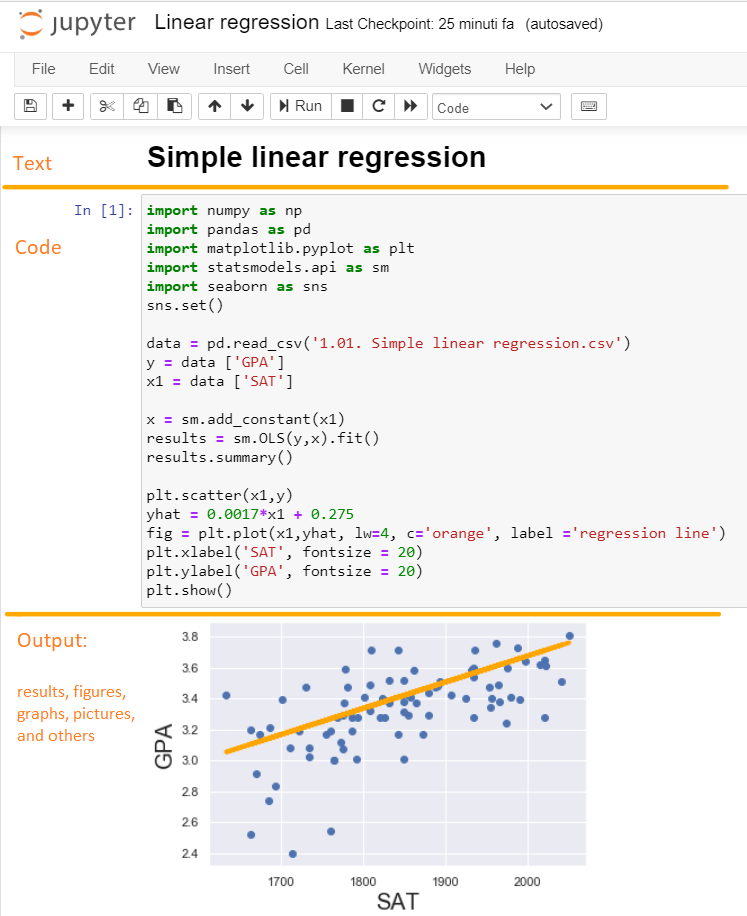

# Introduction <!-- omit in toc -->

## Contents <!-- omit in toc -->

- [Python](#python)
   - [Pandas](#pandas)
   - [NumPy](#numpy)
   - *[Matplotlib](#matplotlib)*
   - *[Seaborn](#seaborn)*
   - *[Scikit-learn](#scikit-learn)*
 - [Jupyter Notebook](#jupyter-notebook)
 - [Anaconda](#anaconda)
 - [Machine Learning](#machine-learning)
   - [Supervised Learning](#supervised-learning)
   - [Unsupervised Learning](#unsupervised-learning)
 - [Preprocessing data](#preprocessing-data)
 - [Forecast Analysis](#forecast-analysis)
   - [Prophet](#prophet)
   - *[ARIMA: Autoregressive integrated moving average](#arima-autoregressive-integrated-moving-average)*
 - [References](#references)
 - [Agenda](#agenda)
  
## Python

Python is an *open-source*, *high-level*, *general-purpose* programming language.

It is meant to be an easily readable language, thanks to its **clear and intuitive syntax**, close to human logic, Python is easy to learn and implement. 

It is a pseudocompiled language: an interpreter takes care of analyzing the source code and, if syntactically correct, of executing it. In Python, there is no separate compilation phase (as in C, for example) that generates an executable file starting from the source. 
Being pseudo-interpreted makes Python a **portable language**. Once a source has been written, **it can be interpreted and executed on most of the platforms currently used**, both from Apple (Mac) and PC (Microsoft Windows and GNU / Linux). Simply, the presence of the correct version of the interpreter is enough.
 
Python is free and has a **large community that contributes to its continuous development and upgrading**, so it is constantly updated. **It comes with an extremely rich built-in library**, which together with automatic memory management and robust constructions for handling exceptions makes Python one of the richest and most comfortable languages ​​to use.

These are some of the reasons Python is a perfect fit for scientific and numerical applications.

### Pandas

ML requires continuous data processing, and Python’s libraries let you access, handle and transform data.

Pandas is perfectly suited for high-level data structures and analysis. It allows merging, filtering, selecting, grouping, and organizing data in a tabular form (attaching descriptive labels to rows and columns), as well as gathering it from other external sources like Excel, for instance.

example 1:
```Python
import pandas as pd

data = pd.DataFrame([['George', 18],['Mark', 25]], columns = ['Name', 'Age'])

data

     Name  Age 
0  George   18
1    Mark   25
```
example 2:
```Python
import pandas as pd

data = pd.read_csv('File.csv'))

data
 
  col1 col2  col3
0    a    b     1
1    a    b     2
2    c    d     3
```
Pandas is a fast, powerful, **flexible and easy to use open source data analysis and manipulation tool**,
built on top of the Python programming language. 

### NumPy

NumPy is an open source Python library that is used in almost every field of science and engineering. **It is the universal standard for working with numerical data in Python**.

The NumPy library contains multidimensional array and matrix data structures. It provides ndarray, a homogeneous n-dimensional array object, with methods to efficiently operate on it. NumPy can be used to perform a wide variety of mathematical operations on arrays. It adds powerful data structures to Python that guarantee efficient calculations with arrays and matrices and it supplies an enormous library of high-level mathematical functions that operate on these arrays and matrices.

```Python
x = np.array([[1, 2], [3, 4]])
y = np.array([[5, 6]])

np.concatenate((x, y), axis=0)
array([[1, 2],
       [3, 4],
       [5, 6]])
```

### *Matplotlib*

Matplotlib is a **2D plotting library** for creating histograms, charts, and other forms of visualization, especially designed for visualizing NumPy computations.
N.B. NumPy, Pandas, Matplotlib are part of the larger SciPy libraries. SciPy contains a lot of tools for maths, engineering, machine learning, and so on.

```Python
import pandas as pd
import numpy as np
import matplotlib.pyplot as plt

data = pd.read_csv('File.csv')

y = data ['Variable Y']
x = data ['Variable X']

plt.scatter(x,y)
plt.xlabel('Variable X', fontsize = 20)
plt.ylabel('Variable Y', fontsize = 20)

plt.show()
```


### *Seaborn*

Seaborn is a Python data visualization library based on matplotlib. **It provides a high-level interface for drawing attractive and informative statistical graphics**. Behind the scenes, seaborn uses matplotlib to draw plots. By applying the default seaborn theme, scaling, and color palette through *sns.set()*, we will affect how all matplotlib plots look like.


### *Scikit-learn*

Scikit-learn, also known as sklearn, **is a free software machine learning library** for the Python programming language. It features various classification, regression and clustering algorithms including support vector machines, random forests, gradient boosting, k-means and DBSCAN, and is designed to interoperate with the Python numerical and scientific libraries NumPy and SciPy.

```Python
import numpy as np
import pandas as pd
import matplotlib.pyplot as plt
import seaborn as sns
sns.set()
from sklearn.linear_model import LinearRegression

data = pd.read_csv('real_estate_price_size_year.csv')

x = data[['size','year']]
y = data['price']

reg = LinearRegression()
reg.fit(x,y)
```

## Jupyter Notebook

The Jupyter Notebook is an **open-source web application** that allows you to create and share documents that contain live code, equations, visualizations and narrative text. 

Jupyter Notebook can connect to many kernels to **allow programming in many languages**. Language kernels are programs designed to read and execute code in a specific programming language like Python, R, Julia, etc. 
A *Jupyter kernel* is a program responsible for handling various types of requests (code execution, code completions, inspection), and providing a reply. 
Your work will be stored on a notebook document that will have a file format depending on the language, by default Jupyter Notebook ships with the IPython kernel (other kernels can be installed additionally), so for Python notebook the file format is .ipynb.

One of the reasons why Jupyter Notebook is widely used among large corporations is that **facilitates the efficiency and cooperation in the team and between teams**. Imagine working at solving a task that requires coding in different languages (i.g Python, PHP, and Julia), instead of installing different interfaces for each language kernel needed, Jupiter allows you to use the same structure of the notebook type of file and simply connect each notebook to the requested language kernel.

Moreover, Jupyter Notebook **simplyfies the workflow process** incredibly.
It is not a text editor that opens a new window every time you execute a different part of your code. In the same file, messagges and code can be alternated, as well as pictures, graphs, etc.



Moreover, these files can be stored locally or on a remote server.

Uses include: data cleaning and transformation, numerical simulation, statistical modeling, data visualization, machine learning, and much more.

## Anaconda

Anaconda is a **free and open-source distribution of data-science packages** suitable for Windows, Linux, and macOS.
The distribution includes more than 250 of the most commonly used open-source data science and machine learning packages including Python, Jupyter Notebook and all the libraries we have seen so far. If not enough, many others can be installed aeasy. 
Due to the large amount of packages available in the complete version, the installer can be quite big therefore there is also a small, bootstrap version of Anaconda called Miniconda, which includes only conda, Python, the packages they depend on, and a small number of other packages.

## Machine Learning

Machine learning (ML) is the **study of computer algorithms that improve automatically through experience**. It is seen as a subset of artificial intelligence. Machine learning algorithms build a mathematical model based on sample data, known as "training data", in order to make predictions or decisions **without being explicitly programmed to do so**.


Machine learning algorithms are used in a wide variety of applications, such as computer vision, email filtering and online fraud detection, where it is difficult or infeasible to develop conventional algorithms to perform the needed tasks.

   *Email Spam and Malware Filtering: There are a number of spam filtering approaches that email clients use. To ascertain that these spam filters are continuously updated,they are powered by machine learning. When rule-based spam filtering is done, it fails to track the latest tricks adopted by spammers.*
   *Over 325, 000 malwares are detected everyday and each piece of code is 90-98% similar to its previous versions. The system security   programs that are powered by machine learning understand the coding pattern. Therefore, they detects new malware with 2-10% variation easily and offer protection against them.*

   *Online Fraud Detection: Machine learning is proving its potential to make cyberspace a secure place and tracking monetary frauds online is one of its examplesFor example: Paypal is using ML for protection against money laundering. The company uses a set of tools that helps them to comparemillions of transactions taking place and distinguish between legitimate or illegitimate transactions taking place between the buyersand sellers.*

Early classifications for machine learning approaches sometimes divided them into three broad categories:
*Supervised learning*, *Unsupervised learning*, and *Reinforcement learning*. Other approaches or processes have since developed that don't fit neatly into this three-fold categorisation, and sometimes more than one is used by the same machine learning system. For example topic modeling, dimensionality reduction or meta learning. 
As of 2020, *deep learning* had become the dominant approach for much ongoing work in the field of machine learning.

### Supervised Learning

The computer is presented with example inputs and their desired outputs, given by a "teacher", and the goal is to learn a general rule that maps inputs to outputs.

Supervised learning algorithms build a mathematical model of a set of data that contains both the inputs and the desired outputs. The data is known as *training data*, and consists of a set of training examples. Each training example has one or more inputs and the desired output, also known as a supervisory *signal*. Through iterative optimization of an objective function, supervised learning algorithms learn a function that can be used to predict the output associated with new inputs.


An optimal function will allow the algorithm to correctly determine the output for inputs that were not a part of the training data. An algorithm that improves the accuracy of its outputs or predictions over time is said to have learned to perform that task.

### Unsupervised Learning

In this case, no labels are given to the learning algorithm, leaving it on its own to find structure in its input. Unsupervised learning algorithms take a set of data that contains only inputs, and find structure in the data, like grouping or clustering of data points. The algorithms, therefore, learn from test data that has not been labeled, classified or categorized. 


Instead of responding to feedback, unsupervised learning algorithms identify commonalities in the data and react based on the presence or absence of such commonalities in each new piece of data.

## Preprocessing data

In any Machine Learning process, Data Preprocessing is that step in which the data gets transformed, or Encoded, to bring it to such a state that now the machine can easily parse it. In other words, the features of the data can now be easily interpreted by the algorithm.

Often, **data preprocessing is the most important phase of a machine learning project**. It includes cleaning, dealing with missing and duplicates values, feature sampling, feature aggregation,  normalization, transformation, feature extraction and selection, etc.
The product of data preprocessing is the final training set.

## Forecast Analysis

Forecasting is the **process of making predictions of the future based on past and present data** and most commonly by analysis of trends. A commonplace example might be estimation of some variable of interest at some specified future date. 
Risk and uncertainty are central to forecasting and prediction; it is generally considered good practice to indicate the degree of uncertainty attaching to forecasts.

### Prophet

Prophet is open source software released by Facebook’s Core Data Science team. It is a **procedure for forecasting time series data** based on an additive model where non-linear trends are fit with yearly, weekly, and daily seasonality, plus holiday effects. 

The input to Prophet is always a dataframe with two columns: ds and y. The ds (datestamp) column should be of a format expected by Pandas whereas the y column must be numeric and represents the measurement we wish to forecast.

Prophet does not come with Anaconda packages. The easiest way to install Prophet is through conda-forge:

```Shell
conda install -c conda-forge fbprophet
```
Once installed, you can import it as easy as the other packages. It follows the sklearn model API, therefore we first create an instance of the Prophet class and then call its fit and predict methods.

```Python
import numpy as np
import pandas as pd
from fbprophet import Prophet

df = pd.read_csv("File.csv")
df.rename(columns={'Date':'ds', 'Count':'y'}, inplace=True)

model = Prophet()
model_fit = model.fit(df)

future = model.make_future_dataframe(periods=12, freq="M")
forecast = model.predict(future)
```
It works best with time series that have strong seasonal effects and several seasons of historical data. 

### *ARIMA: Autoregressive integrated moving average*

An ARIMA model is a class of statistical models for analyzing and forecasting time series data. It can be applied in some cases where data show evidence of non-stationarity, where an initial differencing step (corresponding to the "integrated" part of the model) can be applied one or more times to eliminate the non-stationarity.

ARIMA stands for Autoregressive Integrated Moving Average, a combination of the key components of the model itself:

- Autoregression (AR), that indicates that the evolving variable of interest is regressed on its own lagged (i.e., prior) values.
- Integrated (I) indicates that the data values have been replaced with the difference between their values and the previous values (and this differencing process may have been performed more than once), in order to make the time series stationary.
- Moving Average (MA) indicates that the regression error is actually a linear combination of error terms whose values occurred contemporaneously and at various times in the past.

A standard notation is used of ARIMA(p,d,q) where p is the number of lag observations included in the model (order of the AR term),  d is the order of differencing (order of the I term), and q is the number of lagged forecast errors (order of MA term).

The purpose of each of these features is to make the model fit the data as well as possible.

## References
1. Python
   - [https://en.wikipedia.org/wiki/Python_(programming_language)](https://en.wikipedia.org/wiki/Python_(programming_language))
   - [https://www.python.org/about/](https://www.python.org/about/)
   - [https://opensource.com/resources/python](https://opensource.com/resources/python)
2. Pandas
   - [https://pandas.pydata.org/](https://pandas.pydata.org/)
3. Numpy
   - [https://numpy.org/](https://numpy.org/)
4. Matplotlib
   - [https://matplotlib.org/](https://matplotlib.org/)
5. Seaborn
   - [https://seaborn.pydata.org/](https://seaborn.pydata.org/)
6. Scikit-learn
   - [https://scikit-learn.org/](https://scikit-learn.org/)
   - [https://en.wikipedia.org/wiki/Scikit-learn](https://en.wikipedia.org/wiki/Scikit-learn)
7. Jupyter
   - [https://jupyter.org/index.html](https://jupyter.org/index.html)
   - [https://en.wikipedia.org/wiki/Project_Jupyter#Jupyter_Notebook](https://en.wikipedia.org/wiki/Project_Jupyter#Jupyter_Notebook)
8. Anaconda
   - [https://en.wikipedia.org/wiki/Anaconda_(Python_distribution)](https://en.wikipedia.org/wiki/Anaconda_(Python_distribution))
   - [https://www.anaconda.com/](https://www.anaconda.com/)
9. Machine Learning
   - [https://en.wikipedia.org/wiki/Machine_learning](https://en.wikipedia.org/wiki/Machine_learning)
   - [https://insights.daffodilsw.com/blog/9-machine-learning-examples-from-day-to-day-life](https://insights.daffodilsw.com/blog/9-machine-learning-examples-from-day-to-day-life)
   - [https://towardsdatascience.com/](https://towardsdatascience.com/)
10. Preprocessing data
    - [(https://en.wikipedia.org/wiki/Data_pre-processing)](https://en.wikipedia.org/wiki/Data_pre-processing)
11. Forecast Analysis
    - [https://en.wikipedia.org/wiki/Forecasting)](https://en.wikipedia.org/wiki/Forecasting)
12. Prophet
    - [https://facebook.github.io/prophet/](https://facebook.github.io/prophet/)
13. ARIMA
    - [https://en.wikipedia.org/wiki/Autoregressive_integrated_moving_average](https://en.wikipedia.org/wiki/Autoregressive_integrated_moving_average)

# Agenda
1. *[Presentation](./01.presentation.md)* :clock230: **14:30**
2. *[Introduction](02.introduction.md)* **14:45**
3. **[Azure Machine Learning Studio (Preview)](03.azure-machine-learning-studio-(preview).md)** :clock330: **15:30**
4. [Demo](04.demo.md) :clock4: **16:00**
5. [Where to go next](05.where-to-go-next.md) **16:20**
6. [Q&A](06.q&a.md) **16:25**