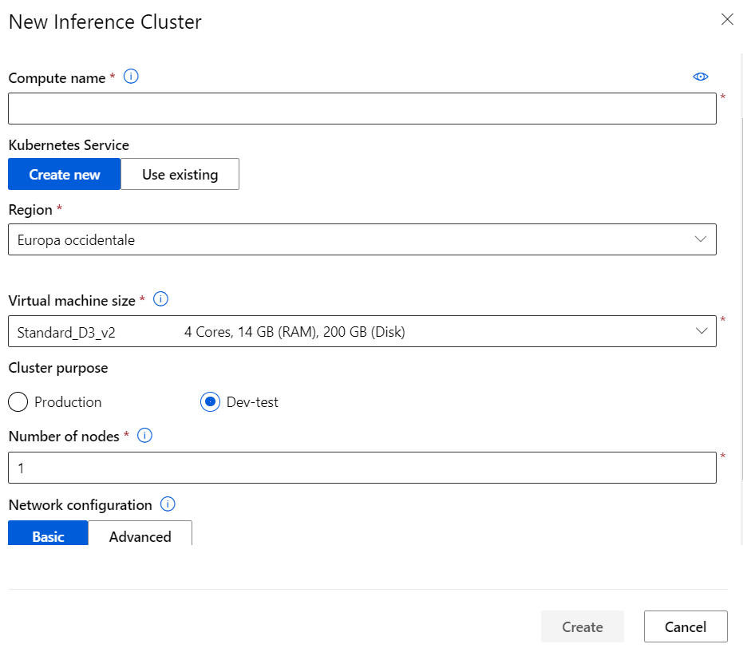

<link href="style.css" rel="stylesheet"></link>

# Azure Machine Learning Studio (Preview) <!-- omit in toc -->

## Contents <!-- omit in toc -->

- [What is Azure ML Studio (Preview)](#what-is-azure-ml-studio-preview)
  - [Differences with Classic version of the platform](#differences-with-classic-version-of-the-platform)
- [Why do we need it](#why-do-we-need-it)
- [How does it work](#how-does-it-work)
  - [Compute](#compute)
    - [Compute Instances](#compute-instances)
    - [Compute Clusters](#compute-clusters)
    - [Inference Clusters](#inference-clusters)
    - [Attached Compute](#attached-compute)
  - [Storage](#storage)
  - [Notebooks](#notebooks)
  - [Work with Computes](#work-with-computes)
    - [JupyterLab](#jupyterlab)
    - [Command Line](#command-line)
- [References](#references)
- [Agenda](#agenda)

## What is Azure ML Studio (Preview)

Empower developers and data scientists with a wide range of productive experiences for building, training, and deploying machine learning models faster. Accelerate time to market and foster team collaboration with industry-leading MLOps—DevOps for machine learning. Innovate on a secure, trusted platform, designed for responsible AI.

*Azure Machine Learning Studio (Preview) portal*

Azure Machine Learning can be used for any kind of machine learning, from classical ml to deep learning, supervised, and unsupervised learning. Whether you prefer to write Python or R code or zero-code/low-code options such as the designer, you can build, train, and track highly accurate machine learning and deep-learning models in an Azure Machine Learning Workspace.
Start training on your local machine and then scale out to the cloud.
The service also interoperates with popular open-source tools, such as PyTorch, TensorFlow, and scikit-learn.

Azure Machine Learning provides all the tools developers and data scientists need for their machine learning workflows, including:
The Azure Machine Learning designer (preview): drag-n-drop modules to build your experiments and then deploy pipelines.
- Jupyter notebooks: use our example notebooks or create your own notebooks to leverage our SDK for Python samples for your machine learning.
- R scripts or notebooks in which you use the SDK for R to write your own code, or use the R modules in the designer.
- Visual Studio Code extension
- Machine learning CLI
- Open-source frameworks such as PyTorch, TensorFlow, and scikit-learn and many more

### Differences with Classic version of the platform

*Azure Machine Learning Designer*

| Quick comparison |                 |                |
|--------------|-----------------|----------------|
|              | Classic         | Preview        |
| Drag and drop interface |	Supported	| Supported |
| Experiment	   | Scalable (10-GB limit) |	Scale with compute target |
| Training compute targets | Proprietary compute target, CPU support only | Wide range of customizable training compute targets. Both GPU and CPU |
| ML Pipeline  | Not supported   | Build flexible, modular pipelines to automate workflows |
| MLOps        | Basic model management and deployment | Entity versioning (model, data, workflows), workflow automation, integration with CI/CD tooling |
| Model format | Proprietary format, Studio (classic) only | Multiple supported formats depending on training job type |

## Why do we need it

Nowadays Machine Learning is achieved by using a set of different and unrelated technologies, tools, languages, storage and compute devices that are often manually combined together. 

Azure Machine Learning Studio fills this gap by integrating and orchestrating everything together with a functional web interface. 

It allows the data scientists to use all the open source technologies that are today standard in Machine Learning.

It helps reduce the cost by paying only the effective compute time used.

## How does it work

The standard flow used to implement your machine learning task follows these steps:

### Compute

One ore more compute virtual hardware are created according to your needs. There four different type

#### Compute Instances

This is the base compute unit

*Compute istance creation*

Customization options are
- Name
- Type
- - CPU: standard type
- - GPU: if your alghoritm are suitable for high parallelizable computing
- Size: a list of wide options for Virtual Machine configuration, classified by
- - Categories: General Purpose, Memory Optimized, Compute Optimized
- - Cores: up to 128
- - RAM: up to 3.8TB 
- - GPU: up to 8x Nvidia Tesla

*Virtual Machine size*

#### Compute Clusters

For heavy workloads, cluster of the same size of virtual machine can be created.
You can choose minimum and maximum number of nodes. 
In order to minimize costs, an "Idle seconds before scale down" option can be sets

*Virtual Machine size*

#### Inference Clusters

Docker, Container and Kubernetes are spreading everywhere, especially in Machine Learning, where high workload may be needed for short periods.

*Kubernetes cluster options*

#### Attached Compute

If you already have any compute instance inside Azure, but created outside Machine Learning Studio already configured, they can be attached with few seconds

### Storage 

Machine Learning Studio, form an Azure organization point of view, is a Resource Group and, as the name states, it's a group where different type of cloud resource can be created. 
Since there can't be any Machine Learning without any data, a default storage account is created behind where the data scientist can update his data in may forms.

Storage is also used to store the output of experiment, with both data and images.

### Notebooks

Notebooks is the section of Azure Machine Learning Studio where you'll spent most of your time.
User file, divided in per-user folder, allows browsing the previously mentioned storage where all your project's file are stored.
There's a folder, named "tutorial" where a collection of sample projects are present that will help you familiarize with the platform.  
Open a notebook file with .ipynb extension and choose a compute unit previously created 

*Notebook inside Machine Learning Studio*

It's possibile to edit the notebooks directly in the Machine Learning studio, but there're better ways to work with them

### Work with Computes

#### JupyterLab

The compute istance is always a Linux virtual machine with embedded all the tools and framework described in the introduction.
One of these tools is JupyterLab that enables you to work with documents and activities such as Jupyter notebooks, text editors, terminals, and custom components in a flexible, integrated, and extensible manner. 

*Jupyter Lab interface*

You can arrange multiple documents and activities side by side in the work area using tabs and splitters. Documents and activities integrate with each other, enabling new workflows for interactive computing, for example:

- Code Consoles provide transient scratchpads for running code interactively, with full support for rich output. A code console can be linked to a notebook kernel as a computation log from the notebook, for example.
- Kernel-backed documents enable code in any text file (Markdown, Python, R, LaTeX, etc.) to be run interactively in any Jupyter kernel.
- Notebook cell outputs can be mirrored into their own tab, side by side with the notebook, enabling simple dashboards with interactive controls backed by a kernel.
- Multiple views of documents with different editors or viewers enable live editing of documents reflected in other viewers. For example, it is easy to have live preview of Markdown, Delimiter-separated Values, or Vega/Vega-Lite documents.

JupyterLab also offers a unified model for viewing and handling data formats. JupyterLab understands many file formats (images, CSV, JSON, Markdown, PDF, Vega, Vega-Lite, etc.) and can also display rich kernel output in these formats. See File and Output Formats for more information.

To navigate the user interface, JupyterLab offers customizable keyboard shortcuts and the ability to use key maps from vim, emacs, and Sublime Text in the text editor.

JupyterLab extensions can customize or enhance any part of JupyterLab, including new themes, file editors, and custom components.

JupyterLab is served from the same server and uses the same notebook document format as the classic Jupyter Notebook.

#### Command Line

*Jupyter Lab Command Line*

## References

- What is Azure ML Studio (Preview)
  - https://azure.microsoft.com/en-us/services/machine-learning/
  - https://docs.microsoft.com/it-it/azure/machine-learning/
- Why do we need it
  - 
- How does it work
  - https://ml.azure.com/
  - https://docs.microsoft.com/it-it/azure/machine-learning/tutorial-1st-experiment-sdk-setup
  - https://jupyterlab.readthedocs.io/en/stable/getting_started/overview.html
  
## Agenda
1. *[Presentation](./01.presentation.md)* :clock230: **14:30**
2. *[Introduction](02.introduction.md)* :clock245: **14:45**
3. *[Azure Machine Learning Studio (Preview)](03.azure-machine-learning-studio-(preview).md)* :clock330: **15:30**
4. **[Demo](04.demo.md)** :clock4: **16:00**
5. [Where to go next](05.where-to-go-next.md) :clock420: **16:20**
6. [Q&A](06.q&a.md) :clock425: **16:25**