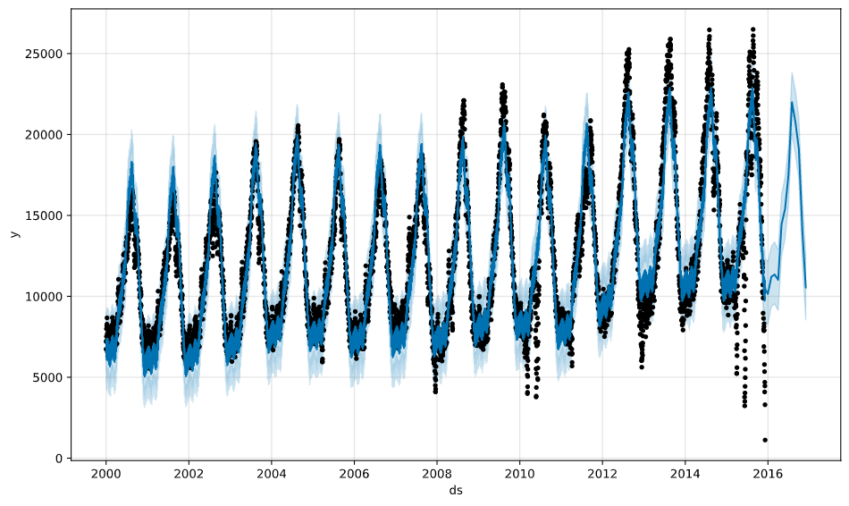
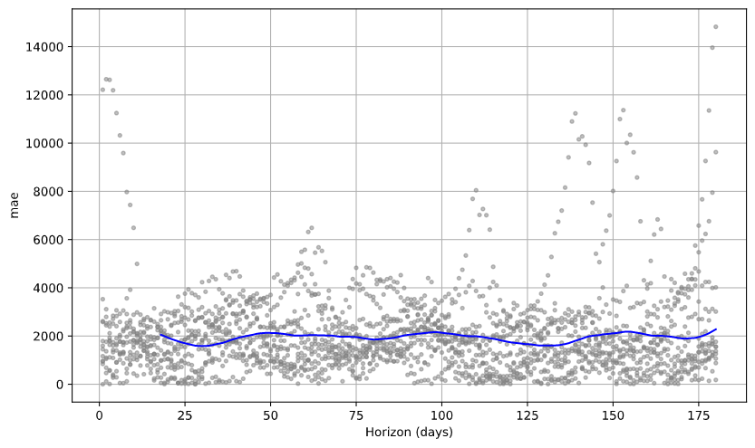
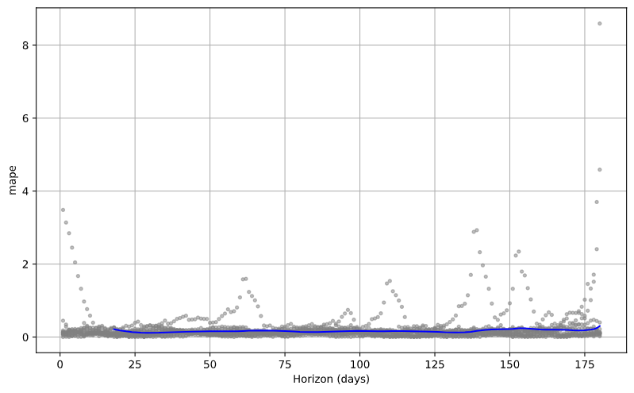
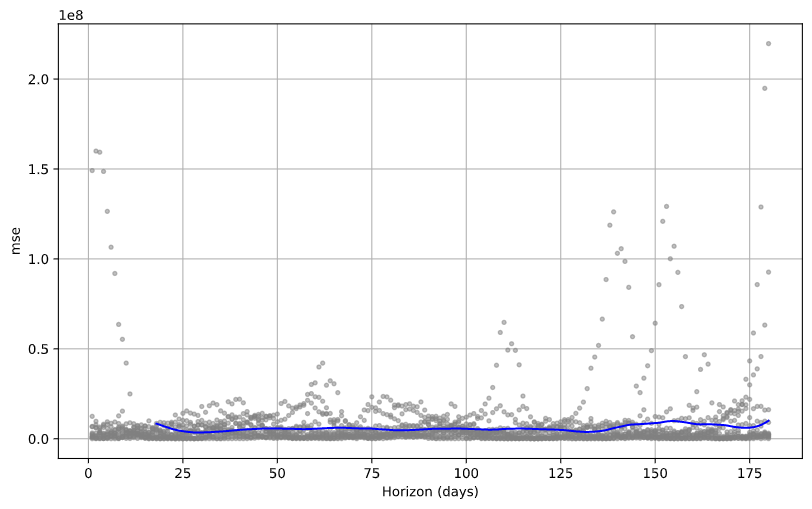
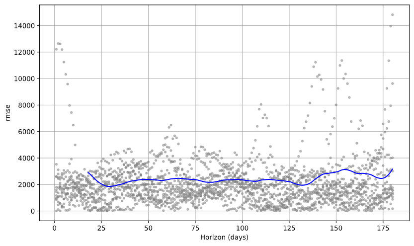

# Demo <!-- omit in toc -->

## Contents <!-- omit in toc -->

- [Setup Azure ML Studio](#setup-azure-ml-studio)
- [Data](#data)
  - [Preprocessing the Data](#preprocessing-the-data)
  - [Code explanation](#code-explanation)
- [Train the Prophet model and prediction of the trend](#train-the-prophet-model-and-prediction-of-the-trend)
- [Test the Prophet model](#test-the-prophet-model)
- [References](#references)
- [Agenda](#agenda)
  
## Setup Azure ML Studio
## Data

The data we will use represents a car rental business.
We want to be able to predict which will be the future trend for the rental based on the more than 10 years of experience and accumulated information.

### Preprocessing the Data

To obtain the information we were interested in, we extracted the data about the rental of the vehicles.
More precisely, we extracted the data from *1995 to 2016*, for a grand total of *14.140.090 records*.

For each rental operation we have evidence of the station and the date at which the vehicle was rented and the station and Date at which the vehicle was returned.
Other information about the vehicle are also present, like the vehicle type, fuel type, transmission, bodyType, the engine power, etc.

|   |   StatIn |  StatOut |              DateIn |             DateOut | GroCode | FuelType | BodyType | VehicType | KW | CO2Emission | fTransmis | DoorsNum |
| - | -        | -        | -                   | -                   | -       | -        | -        | -         | -  | -           | -         | -        |
| 0 | 51898668 | 51898697 | 1995-03-21 18:16:00 | 1995-01-21 18:16:00 |       J |        G |      5DR |         1 | 66 |           1 |         S |      NaN |
| 1 | 51898593 | 51898593 | 1995-03-14 09:39:00 | 1995-02-12 09:40:00 |       J |        G |      5DR |         1 | 66 |           1 |         S |      NaN |
| 2 | 51898527 | 51898527 | 1995-03-16 15:30:00 | 1995-02-14 15:21:00 |       J |        G |      5DR |         1 | 66 |           1 |         S |      NaN |
| 3 | 51898094 | 51898094 | 1995-03-17 15:29:00 | 1995-02-15 15:30:00 |       H |        D |      5DR |         1 | 96 |           1 |         S |      NaN |
| 4 | 51898595 | 51898595 | 1995-03-19 15:30:00 | 1995-02-17 15:15:00 |       J |        G |      5DR |         1 | 66 |           1 |         S |      NaN |


As you may notice the data are neither precisely the ones we want, nor perfect.
For example the DoorsNum presents a lot of NaN values that may be a problem for us.
We have to preprocess them in order to clean and extract the information we want.

More precisely, *we want to know how many cars were in use each day*.

Due to the hugeness of the data we have and the complexity of the task we needed to accomplish, we needed the power of the cloud to obtain a result.
We loaded the data in an Azure Blob Storage and write a [python script](./src/preprocessing/occurrencies-byday.py) that would download the data from the storage, perform the data preprocessing, and write the result on the storage.
We then created a [Docker image](./src/preprocessing/FleetOccupationByDay.Dockerfile) with the python script and used the [Container Instances Service](https://azure.microsoft.com/en-us/services/container-instances/), to run a set of powerfull containers to do the preprocessing operation.

The output of the script is a row for each day in the interval of interest with the count of the vehicles that was out that day.

| Date       | Count |
|-           | -     |
| 2000-01-01 | 6733  |
| 2000-01-02 | 7199  |
| 2000-01-03 | 7239  |
| 2000-01-04 | 7521  |
| 2000-01-05 | 8001  |

### Code explanation

The python script as first thing connects to the Azure Blob Storage where are stored the data and downloads the data file.

```py
spa = ServicePrincipalAuthentication(tenant_id=tenant_id,
                                    service_principal_id=service_principal_id, 
                                    service_principal_password=auth_secret)

ws = Workspace(subscription_id, resource_group, workspace_name, auth=spa,
            _location=location, _disable_service_check=False, _workspace_id=None, sku=sku)

datastore = ws.get_default_datastore()
datastore.download("../Data/", prefix="CSV/")
```

Then it reads the downloaded csv and applies some filters to remove entries not of interest

```py
df = pd.read_csv(path_to_data, date_parser=lambda x: parse_date(x), usecols=cols, parse_dates=[
                    'DateOut', 'DateIn'], encoding="UTF-16 LE", sep=';', quotechar='"', error_bad_lines=False)
print("Read data", len(df))

# Filter data
df["fTransmis"] = df["fTransmis"].transform(
    lambda x: "M" if x == "S" else "A")
print("Transformed transmis data", len(df))

# Drop where fueltype is E or H
df.drop(df[df.FuelType == "E"].index, inplace=True)
print("dropped fueltype E", len(df))

df.drop(df[df.FuelType == "H"].index, inplace=True)
print("dropped fueltype H", len(df))

# Data before 2000 are not valuable, removing cars returned before 2000
# i.e. in 2000 were occupied
df.drop(df[df.DateIn < datetime(2000, 1, 1)].index, inplace=True)
print("dropped datein before 2000-01-01", len(df))

df = df.dropna()
print("dropped na; filtered data", len(df))
```

Finally, it start to work on cleaned data to extract the information of interest using a Pool of threads

```py
occs_byday(mt=num_thread)

def occs_byday(mt=6):
    p = Pool(mt)
    p.map(_byday, dateIntervals)
```

Each thread works on an interval of provided dates (yearly defined in our case, as an example `["2009-01-01", "2010-01-01"]`).
The `_byday` function parses the provided dates and extracts from the dataset all the records with DateOut after the max value of the provided interval and all the records with DateIn before the min value of the provided interval.
In other words, it filters out all the records of vehicles rented after or returned before the period of interest.

After that it creates a dictionary where the keys will be the dates for each day in the interval and the value the number of vehicles.
For each record it increases the value in the dictionary for each day the vehicle was out with respect to the provided interval.

```py
def _byday(dates: List[str]) -> Dict[str, int]:
    print("Run for dates: ", dates)
    mindate, maxdate = datetime.strptime(
        dates[0], "%Y-%m-%d"), datetime.strptime(dates[1], "%Y-%m-%d")

    gf = df.drop(df[df.DateOut > maxdate].index, inplace=False)
    gf.drop(gf[gf.DateIn < mindate].index, inplace=True)
    gf.dropna()

    print("Filtered data:", len(gf))

    occs = {}
    for _, row in gf.iterrows():
        if (row.DateOut >= mindate or row.DateOut < maxdate) and (row.DateOut < mindate or row.DateIn > mindate):
            tdelta = row.DateIn - row.DateOut  # type: timedelta

            if tdelta.days > 0:
                for i in range(0, int(tdelta.days), 1):
                    dd = row.DateOut + timedelta(days=i)
                    if dd < maxdate and dd > mindate:
                        k = dd.strftime("%Y-%m-%d")
                        occs[k] = occs.setdefault(k, 0) + 1

    dict_to_csv("occs-"+mindate.strftime("%Y"), occs)
```

## Train the Prophet model and prediction of the trend

To train a Prophet model, as first thing we need to parse the data and rename the columns to respect the prophet expectations

```py
xf = pd.read_csv(path_to_data, date_parser=lambda x: parse_date(x), parse_dates=['Date'],
                encoding="UTF-8", sep=',', quotechar='"', error_bad_lines=False)

xf.rename(columns={'Date':'ds', 'Count':'y'}, inplace=True)
```

We proceed with the instantiation of the model and the fit (train) of it

```py
model = Prophet()
model_fit = model.fit(xf)
```

We create a future dataframe of 12 months and use it to perform a prediction

```py
future = model.make_future_dataframe(periods=12, freq="M")
future.tail()

forecast = model.predict(future)
```

The result of the prediction (2016-2017) is shown in the following picture togheter with the train data (2000-2016)



During the fit, Prophet tunes its components that it is useful to display; i.e. trend and seasonality (weekly, yearly)

```py
model.plot_components(forecast)
```


## Test the Prophet model

Finally we have to test the model to have some measures on how it's performing.
We perform a Cross Validation on the model using the Prophet's Cross Validation.

Prophet includes functionality for time series cross validation to measure forecast error using historical data.
This is done by selecting cutoff points in the history, and for each of them fitting the model using data only up to that cutoff point.
We can then compare the forecasted values to the actual values.
This figure illustrates a simulated historical forecast, where the model was fit to a initial history of 5 years, and a forecast was made on a one year horizon.

This cross validation procedure can be done automatically for a range of historical cutoffs using the cross_validation function.
We specify the forecast horizon (horizon), and then optionally the size of the initial training period (initial) and the spacing between cutoff dates (period).


We perform the cross validation on our model using an *initial* value of 10 year, a *period* of 180 days and an *horizon* of 180 days.

```py
from fbprophet.diagnostics import cross_validation
df_cv = cross_validation(model_fit, initial='3650 days', period='180 days', horizon='180 days')
```

Then we calculate the performance metrics

```py
from fbprophet.diagnostics import performance_metrics
df_p = performance_metrics(df_cv)
```

Plot the Mean Absolute Error (MAE)

```py
from fbprophet.plot import plot_cross_validation_metric
fig = plot_cross_validation_metric(df_cv, metric='mae')
```



Plot the Mean Absolute Percentage Error (MAPE)

```py
from fbprophet.plot import plot_cross_validation_metric
fig = plot_cross_validation_metric(df_cv, metric='mape')
```



Plot the Mean Squared Error (MSE)

```py
from fbprophet.plot import plot_cross_validation_metric
fig = plot_cross_validation_metric(df_cv, metric='mse')
```



Plot the Root Mean Squared Error (RMSE)

```py
from fbprophet.plot import plot_cross_validation_metric
fig = plot_cross_validation_metric(df_cv, metric='rmse')
```




## References
- Data
  - https://azure.microsoft.com/en-us/services/container-instances/
- Train the Prophet model and prediction of the trend
  - https://facebook.github.io/prophet/
  - https://github.com/facebook/prophet
- Test the Prophet model
  - https://facebook.github.io/prophet/docs/diagnostics.html
- Other examples with Prophet
  - https://github.com/facebook/prophet/blob/master/notebooks/


## Agenda
1. *[Presentation](./01.presentation.md)* :clock230: **14:30**
2. *[Introduction](02.introduction.md)* **14:45**
3. *[Azure Machine Learning Studio (Preview)](03.azure-machine-learning-studio-(preview).md)* :clock330: **15:30**
4. *[Demo](04.demo.md)* :clock4: **16:00**
5. **[Where to go next](05.where-to-go-next.md)** **16:20**
6. [Q&A](06.q&a.md) **16:25**